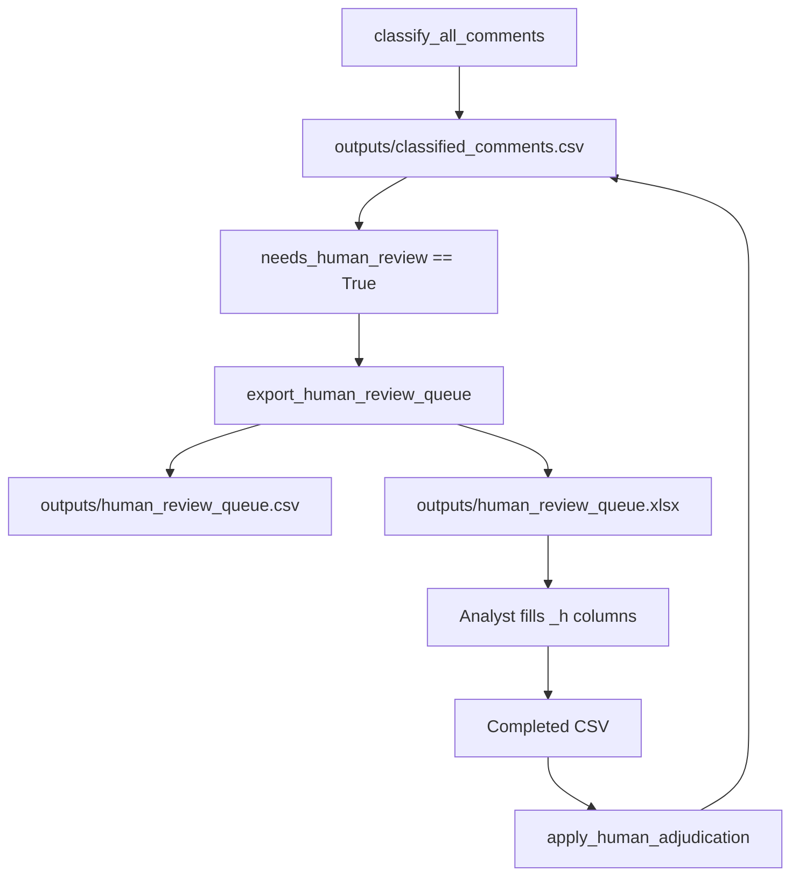

# Automatic Comment Classification — Methodological Dossier

Reference document for writing the Methods section of the paper. Implementation lives in `classification/`; ingestion, preprocessing, and orchestration are in [`pipeline_extraction.ipynb`](../pipeline_extraction.ipynb).

This dossier separates three evidence classes:

1. **Implemented procedure** — behavior defined in source code.
2. **Recorded run result** — values taken from committed outputs (`outputs/aggregates/`, `outputs/samples/`, `outputs/figures/`, notebook execution logs).
3. **Not stored in repository** — listed in [Section 14](#14-missing-information-register); not inferred here.

---

## 1. Research design and corpus

### 1.1 Analytical framework

The study applies **thematic content analysis** to Instagram comments on three international celebrity posts. The design follows a hybrid deductive–inductive codebook (Bardin, 2016; Hsieh & Shannon, 2005; Braun & Clarke, 2006) grounded in **Social Identity Theory** (Tajfel & Turner, 1979). Comments are classified on three axes:

| Axis | Cardinality | Storage |
|------|-------------|---------|
| **Theme (TEMA)** | Multi-label (1–3 categories C1–C5, or N.A.) | Binary columns `theme_C1` … `theme_C5`, `theme_NA` |
| **Character (CARÁTER)** | Single-label | `character` (Afetivo / Cognitivo) |
| **Tone (TOM)** | Single-label | `tone` (Positivo / Negativo / Neutro) |

Data collection follows netnographic principles (Kozinets, 2014): observation of spontaneous user behavior in its natural online context.

### 1.2 Cases and unit of analysis

**Unit of analysis:** one Instagram comment, anonymized before classification.

Three cases were selected for international posts with substantial Brazilian engagement:

| Case ID | Post context (from `CASE_CONTEXT`) | N (full corpus) |
|---------|-----------------------------------|-----------------|
| `Bruno_Mars` | American singer Bruno Mars thanking the Brazilian audience after his tour | 8,100 |
| `Fernanda_Torres` | Official Academy Awards profile highlighting Fernanda Torres for Oscar 2025 nomination | 6,619 |
| `CR7` | Cristiano Ronaldo paying tribute to Pelé after his death | 2,568 |
| **Total** | | **17,287** |

Case definitions: `classification/constants.py` lines 36–66.

### 1.3 Corpus scope — implemented vs. planned

**Implemented (recorded run):** The pipeline classifies **all 17,287** scraped comments. No top-N, likes-based, or `is_brazilian` exclusion filter is applied at classification time (`pipeline_extraction.ipynb`, `create_final_df` docstring: *"No exclusion filters or top-N subsampling; every row in df is retained."*).

**Planned but not implemented:** An earlier thesis draft (`__tmp_metodo_tcc.txt`) describes 200 top-liked comments per case (600 total) with Brazilian-user replacement sampling. That subsample was **not** applied in the executed pipeline. Any paper must reconcile this deviation explicitly.

### 1.4 Brazilian-user detection (metadata only)

`is_brazilian` is a composite Boolean computed from three OR-combined tests (`pipeline_extraction.ipynb`):

1. **Linguistic:** Portuguese detected via `langdetect` (`DetectorFactory.seed = 42`; minimum text length 10 characters).
2. **Authorship profile:** Username heuristics (Brazilian name patterns, `.br` domains).
3. **Cultural traces:** Regex for Brazilian digital markers (e.g., "vem pro Brasil", "kkkk").

**Recorded result:** 11,706 / 17,287 comments flagged `is_brazilian = True` (67.7%).

**Important:** `is_brazilian` is passed to LLM coders as a **hint**, not as an inclusion gate (`classification/pipeline.py` lines 41–51).

---

## 2. Preprocessing and anonymization

Preprocessing runs in `pipeline_extraction.ipynb` before classification.

| Step | Procedure | Output column |
|------|-----------|---------------|
| Drop empty comments | Remove rows with blank `comment` | — |
| Deduplication | By `hash_id` | — |
| Normalization | Strip + lowercase | `comment_norm` |
| Emoji extraction | `emoji.distinct_emoji_list()` | `emojis_list` |
| Hashtag extraction | Regex | `hashtags_list` |
| Date parsing | ISO coercion (`errors="coerce"`) | `date_iso`, `days_old` |
| Anonymization | `@handle` → `@user`; drop `username` | `comment_anon` |
| ID assignment | `{CASE}_{padded_seq}` after sort by `date_iso` | `hash_id` |

**Classification input:** LLM coders receive `comment_anon` (not raw `comment`). Deterministic rules use `comment_norm` for regex matching and `comment_anon` / `emojis_list` for emoji-only detection.

---

## 3. Analytical codebook

Operational definitions are enforced in three layers: Pydantic schema (`classification/schema.py`), LLM system prompts (`classification/agents.py`), and deterministic rules (`classification/rules.py`).

### 3.1 Theme categories (multi-label)

| Code | English label | Operational definition |
|------|-----------------|------------------------|
| **C1** | Nationalism / Pride | Pride in Brazil, Brazilian people, or Brazilian cultural products/icons |
| **C2** | Humor / Satire / Meme | Primary function is joke, irony, meme, or digital playfulness |
| **C3** | Conflict / Rivalry | Defensive posturing, rivalry, or hostility toward out-groups |
| **C4** | Validation / Affect toward foreigner | Brazilians directing affection, gratitude, or attention-seeking toward a foreign celebrity, brand, or audience |
| **C5** | Digital space appropriation | Brazilian users occupying or coordinating on a foreign-language page as a parallel community |
| **N.A.** | Not applicable | No C1–C5 function is plausible given post context (**exclusive** of C1–C5) |

**Constraints** (enforced by `ThemeFlags` validator, `schema.py` lines 18–29):

- At least one label (theme or N.A.) is required.
- N.A. is mutually exclusive with all C themes.
- Maximum **3 simultaneous C themes** per comment.

### 3.2 Character axis (single-label)

| Value | Definition |
|-------|------------|
| **Afetivo** | Emotional / subjective — praise, love, pride, humor, anger, birthday wishes, exclamations |
| **Cognitivo** | Informational — statistics, view counts, questions, neutral announcements |

Short praise ("maravilhosa", "👏") is coded Afetivo even when brief.

### 3.3 Tone axis (single-label)

| Value | Definition |
|-------|------------|
| **Positivo** | Admiration, joy, support, pride, playful humor |
| **Negativo** | Criticism, anger, rivalry, indignation, disdain |
| **Neutro** | Factual, interrogative, or emotionally flat |

Tone operationalization follows sentiment-analysis conventions (Pang & Lee, 2008).

### 3.4 Confidence calibration (LLM only)

Self-reported confidence bands from the coder prompt:

| Range | Interpretation |
|-------|----------------|
| 0.90–1.00 | Unambiguous theme set, multiple consistent signals |
| 0.70–0.89 | Theme set fits but another combination is plausible |
| 0.65–0.69 | Weak / implicit signals |
| < 0.65 | Very uncertain; prefer best plausible C category over N.A. when post context supports it |

`theme_confidence` reflects certainty of the **entire assigned theme set**. Confidence values are **metadata only**; they do not gate human review.

### 3.5 Stakeholder axis (not implemented)

An earlier codebook draft (`__tmp_metodo_tcc.txt`) included a stakeholder dimension (Common User, Celebrity, Media, Brand). This axis was **not implemented** because anonymization removed usernames and follower metadata.

---

## 4. Classification pipeline overview

```text
Anonymized comment + metadata
        │
        ▼
┌───────────────────┐
│ Deterministic     │──► stable surface pattern ──► final labels (source = rule)
│ rules (Stage 1)   │     no LLM, no reviewer, no human queue
└─────────┬─────────┘
          │ no rule match
          ▼
┌───────────────────┐
│ Coder A ∥ Coder B │  openai:gpt-5-nano, identical prompts, independent calls
└─────────┬─────────┘
          │
    full theme set equal?
    (including N.A.)
    ┌─────┴─────┐
   yes          no
    │            ▼
    │     ┌──────────────┐
    │     │ Reviewer     │  openai:gpt-5-mini, sees A + B + comment
    │     └──────┬───────┘
    │            │
    └─────┬──────┘
          ▼
   final labels (multi-label C1–C5 or N.A.)
          │
          │ (only if reviewer was invoked)
          ▼
   max(κ_rev,A, κ_rev,B) < 0.80 ?
          │
         yes ──► human review queue
```

**Orchestration:** `classification/pipeline.py` → `classify_all_comments()`.

**Critical gate properties:**

- Theme agreement compares the **full theme set** via `theme_codes_from_flags()` — including N.A. vs. C-theme disagreements.
- **Character and tone do not affect** the agreement gate or reviewer invocation.
- When themes agree, **Coder A's** character and tone become final labels regardless of Coder B.

---

## 5. Stage 1 — Deterministic rules

### 5.1 Purpose and design principles

Rules cover stable surface patterns (emoji-only reactions, campaign hashtags, slogan regexes) without LLM cost. Principles (`classification/rules.py`):

- Fire only on conservative, repeatable patterns.
- Return the same schema as the LLM (multi-label flags + character + tone + confidences).
- Skip dual coding, reviewer, and human queue.
- All rule confidences must be ≥ `RULE_MIN_CONFIDENCE = 0.82`.

### 5.2 Rule inventory

Rules are evaluated in order; first match wins.

| Rule ID | Trigger | Themes | Applies to |
|---------|---------|--------|------------|
| `rumoaos200m_shell` | `#rumoaos200m` hashtag shell, no text | {C5} | Any row (not emoji-only gated) |
| `come_to_brazil` | Regex `PAT_COME_TO_BRAZIL` on `comment_norm` | {C4} | Any row (not emoji-only gated) |
| `flag_only_fernanda` | 🇧🇷 only, Fernanda case | {C1} | Emoji-only |
| `flag_only_foreign_thread` | 🇧🇷 only, foreign case | {C5} | Emoji-only |
| `affect_heart_*` | Single ❤️ emoji | case-dependent | Emoji-only |
| `affect_clap_*` | Single 👏 emoji | case-dependent | Emoji-only |
| `affect_fire_*` | Single 🔥 emoji | case-dependent | Emoji-only |
| `affect_combo_*` | Generic affect emoji subset | case-dependent | Emoji-only |
| `national_colors_fernanda` | 💛/💚 only (no 🇧🇷) | {C1} | Emoji-only |
| `national_colors_foreign` | 💛/💚 subset; if 🇧🇷 present → {C4,C5}, else {C4} | varies | Emoji-only |
| `flag_location` | 🇧🇷 + 📍 | {C5} | Emoji-only |
| `flag_trophy_fernanda` | 🇧🇷 + 🏆, Fernanda | {C1} | Emoji-only |
| `flag_trophy_foreign` | 🇧🇷 + 🏆; CR7 → {C1,C4}; Bruno → {C4} | varies | Emoji-only |
| `flag_mixed_fernanda` | 🇧🇷 + other emojis | {C1} | Emoji-only |
| `flag_mixed_foreign` | 🇧🇷 + affect emojis → {C4,C5}; else {C5} | varies | Emoji-only |

**Case-dependent affect rules** (`_emoji_affect_rule`):

| Case | Themes |
|------|--------|
| `Fernanda_Torres` | {C1} |
| `Bruno_Mars`, `CR7` | {C4} |
| Unknown case | {NA} |

**Note:** `national_colors_foreign` uses 💛/💚 only (`BR_NATIONAL_COLORS`), not 🇧🇷 alone. The flag 🇧🇷 is handled by `flag_only_*`, `flag_mixed_*`, `flag_location`, and `flag_trophy_*` rules.

### 5.3 Recorded rule coverage (full corpus)

From `pipeline_extraction.ipynb` execution output:

| Metric | Value |
|--------|-------|
| Rule-covered | 11,927 / 17,287 (69.0%) |
| LLM-required | 5,360 / 17,287 (31.0%) |

---

## 6. Stage 2 — Dual LLM coding

### 6.1 Models and framework

| Role | Model | Factory |
|------|-------|---------|
| Coder A & B | `openai:gpt-5-nano` | `create_coder_agent()` |
| Reviewer | `openai:gpt-5-mini` | `create_reviewer_agent()` |

- **Provider:** OpenAI via **Pydantic AI** (`pydantic-ai>=1.60.0`).
- **Output:** Structured JSON validated against `CommentAnalysis` (Pydantic schema).
- **API key:** `OPENAI_API_KEY` from `.env`.

**Decoding parameters:** No `temperature`, `top_p`, `seed`, or `max_tokens` are set in code. Inference uses Pydantic AI / OpenAI provider defaults. See [Section 14](#14-missing-information-register) for run-date documentation.

### 6.2 Concurrency

- Coder A and B run in parallel per comment (`asyncio.gather`).
- Global semaphore: `MAX_CONCURRENT_REQUESTS = 20`.
- Configurable via `semaphore_limit` parameter (default 20; `reprocess_classification_errors.py` uses 5).

### 6.3 Context sent to coders

Built by `build_user_content()` (`pipeline.py` lines 37–60):

```
POST_CONTEXT: {CASE_CONTEXT[case]}
CASE: {case}
CASE_THEME_HINT: {CASE_THEME_HINT[case]}   # when present
DETECTED_LANGUAGE: {language}
LIKELY_BRAZILIAN_USER: {is_brazilian}
TEXT: {comment_anon}
EMOJIS: {emojis_list}
HASHTAGS: {hashtags_list}
```

**Emoji-only branch:** When stripped text length < 2 and emojis are present, `TEXT` is replaced by:

```
COMMENT_SHAPE: EMOJI-ONLY or mention-only.
EMOJIS: {emojis_list}
HASHTAGS: {hashtags_list}
```

Case-specific hints (`CASE_THEME_HINT`) are in `classification/constants.py` lines 51–66. Full prompts are in [Appendix A](#appendix-a-llm-system-prompts-verbatim).

### 6.4 Post-coding agreement gate

After both coders return:

```python
agreed = theme_sets_equal(coder_a, coder_b)
```

`theme_sets_equal()` compares `theme_codes_from_flags()` for both coders. This collapses to `{"NA"}` when `theme_NA=True`, so **N.A. vs. any C-theme disagreement triggers the reviewer** even when all five C1–C5 booleans match.

| Outcome | Action | `classification_source` |
|---------|--------|-------------------------|
| Theme sets equal | Accept Coder A output (including A's character/tone) | `llm_agreed` |
| Theme sets differ | Invoke reviewer (Stage 3) | `llm_reviewer` |

**Character/tone disagreements with theme agreement never reach the reviewer or human queue.**

---

## 7. Stage 3 — Reviewer adjudication

### 7.1 Trigger and input

The reviewer (`openai:gpt-5-mini`) is invoked when Coder A and B disagree on the theme set. It receives the full coder user content plus both codings:

```
--- DISAGREEMENT: adjudicate final labels ---
Coder A themes: …; theme_confidence; character; tone
Coder B themes: …
```

Built by `build_reviewer_content()` (`pipeline.py` lines 63–83).

### 7.2 Reviewer role

The reviewer synthesizes the best-supported theme set from TEXT + EMOJIS + POST_CONTEXT. It does **not** simply pick one coder's side. Full prompt: [Appendix A](#appendix-a-llm-system-prompts-verbatim).

### 7.3 Output

Reviewer output becomes the provisional final label (`classification_source = llm_reviewer`). Character and tone come from the reviewer's adjudication.

---

## 8. Stage 4 — Human review queue

### 8.1 Gate criterion

Human review is triggered **only after reviewer adjudication**:

```
needs_human_review = max(κ_rev_a, κ_rev_b) < KAPPA_HUMAN_THRESHOLD
```

with `KAPPA_HUMAN_THRESHOLD = 0.80`.

**Per-comment κ:** Cohen's κ over the five binary C1–C5 flags between reviewer and each coder (`classification/agreement.py`).

**Rationale:** When A ≠ B, the reviewer often aligns with one coder (κ = 1.0) and partially disagrees with the other. Using `min(κ)` would send nearly every adjudicated row to humans. With `max(κ) < 0.80`, a human reviewer is assigned only when the automatic adjudication does **not** substantially match **either** original coder — a genuinely novel adjudication.

**Rows where A = B** never enter the human queue via this gate (double-coder agreement is sufficient).

**N.A. is excluded from κ computation** (only C1–C5 binary flags are used).

**Degenerate κ handling:** When flag vectors are identical, κ returns 1.0. When `sklearn.metrics.cohen_kappa_score` returns NaN (prevalence imbalance), the implementation also returns 1.0 (`agreement.py` lines 29–33).

### 8.2 Recorded human-review status

From `outputs/classified_comments_human.csv` (post-adjudication merge; local full corpus):

| Metric | Value |
|--------|-------|
| Flagged (`needs_human_review = True`) | 225 |
| Reviewed (`human_reviewed = True`) | 225 (1.3% of corpus) |
| Recoded (`classification_source = human`) | 188 |
| Confirmed without recoding (reviewer labels kept) | 37 |
| Pending | 0 |

### 8.3 Export workflow



**Important:** The working spreadsheet does **not** expose bare `theme_C1`…`theme_NA` columns. Automatic reviewer output appears as read-only `theme_*_rev`. Human adjudication columns `theme_*_h`, `character_h`, and `tone_h` start **empty**.

| Zone | Columns | Role |
|------|---------|------|
| Identification | `hash_id`, `case`, `comment_anon`, `emojis` | Context |
| Summary | `themes_a`, `themes_b`, `themes_rev`, `disagreement`, `kappa_rev_*` | Quick read |
| Coder A | `theme_*_a`, `character_a`, `tone_a`, `confidence_a` | Reference (theme confidence only) |
| Coder B | `theme_*_b`, `character_b`, `tone_b`, `confidence_b` | Reference (theme confidence only) |
| Reviewer | `theme_*_rev`, `character_rev`, `tone_rev`, `confidence_rev` | Automatic suggestion (do not edit) |
| Human | `theme_*_h`, `character_h`, `tone_h`, `human_notes`, `reviewed_by`, `reviewed_at` | **Fill in** |
| Meta | `classification_source`, `needs_human_review` | Audit |

Queue is sorted by ascending `max(κ_rev_a, κ_rev_b)` (lowest agreement first).

On merge, `apply_human_adjudication()` copies filled `theme_*_h` → `theme_*`, sets `classification_source = "human"`, and marks `human_reviewed = True`. Notes-only rows (e.g. "Não BR") are marked reviewed and keep the standing machine labels. Partial fill is allowed (themes only, character/tone only, or notes).

Implementation: `classification/human_review.py`.

### 8.4 Error handling

API failures produce `classification_source = "error"`, `theme_NA = True`, and `needs_human_review = True` in the initial pipeline run. The dedicated script `scripts/reprocess_classification_errors.py` retries error rows and recalculates the human gate (errors are excluded from the queue after reprocessing).

---

## 9. Inter-coder reliability

Two distinct uses of Cohen's κ (Cohen, 1960; Landis & Koch, 1977):

| Use | Scope | Function |
|-----|-------|----------|
| **Operational** | Per comment, reviewer-adjudicated subset | Human queue gate: `max(κ_rev,A, κ_rev,B) < 0.80` |
| **Methodological** | Full LLM subset, label-wise | Global Cohen's κ per theme flag between rater pairs |

**Global κ implementation:** `sklearn.metrics.cohen_kappa_score` on binary columns with `.fillna(False)`. Only C1–C5 flags; N.A. excluded.

**Operational rate denominators:** Computed over rows with `classification_source ∈ {llm_agreed, llm_reviewer}` only. Rule-covered and error rows are excluded.

### 9.1 Recorded reliability statistics

**Pre-adjudication** (`outputs/classified_comments.csv`, LLM subset n = 5,360):

| Metric | Value |
|--------|-------|
| Exact theme-set agreement (A = B) | 71.3% |
| Reviewer invocation rate | 28.7% |
| Human queue rate (of LLM subset) | 4.2% (225 / 5,360) |

**Label-wise κ, Coder A ↔ Coder B:**

| Theme | κ |
|-------|---|
| C1 | 0.840 |
| C2 | 0.732 |
| C3 | 0.809 |
| C4 | 0.831 |
| C5 | 0.555 |

**Label-wise κ, Reviewer ↔ Coder A** (adjudicated subset, n = 1,540):

| Theme | κ |
|-------|---|
| C1 | 0.715 |
| C2 | 0.771 |
| C3 | 0.696 |
| C4 | 0.574 |
| C5 | 0.364 |

**Post-adjudication** (`outputs/classified_comments_human.csv`, LLM subset n = 5,172; 37 CR7 rows were confirmed in the human queue without theme recoding and remain `llm_reviewer`):

| Metric | Value |
|--------|-------|
| Exact theme-set agreement (A = B) | 73.9% |
| Reviewer invocation rate | 26.1% |
| Human queue rate (of LLM subset) | 0 pending (225/225 reviewed; 37 kept reviewer labels) |

**Label-wise κ, Coder A ↔ Coder B (post-adjudication):**

| Theme | κ |
|-------|---|
| C1 | 0.879 |
| C2 | 0.786 |
| C3 | 0.853 |
| C4 | 0.853 |
| C5 | 0.580 |

**Not reported:** κ for character or tone; exact multi-label set agreement beyond the binary gate; human-vs-machine agreement tables (partial analysis exists in `analysis.ipynb` §11).

---

## 10. Aggregation and output artifacts

### 10.1 Table 1 generation

`generate_dataset_final()` in `classification/aggregation.py`:

- **TEMA:** Presence counts per binary flag (multi-label) — case percentages may sum > 100%.
- **CARÁTER / TOM:** Standard single-label crosstabs (mutually exclusive).

Aggregation uses **all rows** in the dataframe; no filter on `human_reviewed` or `classification_source`.

### 10.2 Output files

| File | Content |
|------|---------|
| `outputs/classified_comments.csv` | One row per comment, all classification and audit columns (local only) |
| `outputs/samples/classified_comments_sample.csv` | Same, sample mode (versioned) |
| `outputs/classified_comments_human.csv` | Post human-adjudication merge (local only) |
| `outputs/human_review_queue.csv` | Human queue for merge (CSV; local only) |
| `outputs/human_review_queue.xlsx` | Same queue, formatted for analyst (Excel + Codebook + Instructions sheets; local only) |
| `outputs/samples/human_review_queue_sample.csv` / `.xlsx` | Sample mode (versioned) |
| `outputs/aggregates/final_dataset.csv` | Aggregated N and % by case (Table 1; versioned) |
| `outputs/samples/final_dataset_sample.csv` | Sample mode (versioned) |
| `outputs/aggregates/final_dataset_human.csv` | Post-adjudication aggregation (versioned) |
| `outputs/figures/en/01_*.png` … `09_*.png` | English paper figures (versioned) |
| `outputs/figures/pt/01_*.png` … `09_*.png` | Portuguese paper figures (versioned) |

### 10.3 Key columns for the paper

| Column | Description |
|--------|-------------|
| `theme_C1` … `theme_C5`, `theme_NA` | Final labels (multi-label) |
| `theme_C1_a` … `theme_NA_b` | Independent Coder A and B outputs |
| `theme_conf`, `char_conf`, `tone_conf` | Model self-reported confidence (metadata; not a human gate) |
| `coder_agreement` | `True` if theme sets A = B |
| `reviewer_used` | `True` if reviewer adjudicated |
| `kappa_reviewer_a`, `kappa_reviewer_b` | Per-comment κ (when reviewer used) |
| `needs_human_review` | Human queue flag |
| `classification_source` | `rule` \| `llm_agreed` \| `llm_reviewer` \| `human` \| `error` |
| `rule_id` | Deterministic rule identifier (rule rows only) |
| `theme_C1_human` … `theme_NA_human` | Manual adjudication (post-merge) |
| `human_reviewed` | `True` after human review completed |

**Note:** Rule rows omit `*_a`/`*_b` audit columns. Bare `theme_*` columns hold provisional labels (from agreement, reviewer, or rules) until human merge overwrites them.

### 10.4 Sample mode

For cost calibration before the full run:

| Parameter | Notebook default | `run_classification_sample.py` default |
|-----------|-----------------|----------------------------------------|
| `USE_SAMPLE` | `True` | `False` |
| `SAMPLE_SIZE` | 60 | 250 |
| `SAMPLE_SEED` | 42 | 42 |

Stratified sampling: `per_case = max(1, SAMPLE_SIZE // n_cases)`; `random_state = SAMPLE_SEED`.

Entry points: `pipeline_extraction.ipynb` or `uv run python run_classification_sample.py`.

---

## 11. Reproducibility

### 11.1 Software environment

| Component | Version / constraint | Source |
|-----------|---------------------|--------|
| Python | ≥ 3.13 | `pyproject.toml` |
| pydantic-ai | ≥ 1.60.0 | `pyproject.toml` |
| scikit-learn | ≥ 1.6.0 (Cohen's κ) | `pyproject.toml` |
| langdetect | ≥ 1.0.9 | `pyproject.toml` |
| pandas | ≥ 3.0.0 | `pyproject.toml` |
| openpyxl | ≥ 3.1.0 (human review export) | `pyproject.toml` |

**Not committed:** `uv.lock` (gitignored), raw data (`data/` gitignored), `.env` (API key).

### 11.2 Reproducibility commands

```bash
# Full classification re-run (requires preprocessed CSV without stale columns)
uv run python run_classification_sample.py

# Reprocess API error rows
uv run python reprocess_classification_errors.py

# Apply human adjudication (in notebook or script)
# from classification.human_review import apply_human_adjudication
```

### 11.3 Non-determinism

LLM calls have no fixed seed. Identical re-runs may produce different labels. Rule-covered rows (69%) are deterministic.

### 11.4 Cost model

Token pricing constants (`classification/constants.py`):

| Model | Input (USD / 1M tokens) | Output (USD / 1M tokens) |
|-------|--------------------------|--------------------------|
| gpt-5-nano | $0.05 | $0.40 |
| gpt-5-mini | $0.25 | $2.00 |

**Recorded full-run estimate** (`pipeline_extraction.ipynb` output): ~$3.79 USD total (input $0.544 + output $3.249). Pricing date not recorded — see [Section 14](#14-missing-information-register).

### 11.5 Module map

| Module | Responsibility |
|--------|----------------|
| `constants.py` | Thresholds, column names, case context, pricing |
| `schema.py` | Pydantic multi-label schema and validators |
| `rules.py` | Deterministic classification |
| `emoji_helpers.py` | Emoji-only row detection for rules |
| `agents.py` | LLM prompts and agent factories |
| `agreement.py` | Theme-set equality, κ, human gate, operational rates |
| `pipeline.py` | Async dual-coder + reviewer orchestration |
| `aggregation.py` | Table 1 and rule coverage summary |
| `human_review.py` | Human queue export (CSV/Excel) and post-adjudication merge |

---

## 12. Validity, ethics, and limitations

### 12.1 Internal validity

- **Rule dominance:** 69% of labels come from deterministic rules without human validation. Rule accuracy has not been audited against a gold standard.
- **Character/tone gate gap:** Only themes are dual-coded and κ-gated. Character and tone rely on a single coder when themes agree.
- **Low C5 reliability:** Digital-space appropriation (C5) shows the lowest inter-coder κ (0.555 pre-adjudication; 0.580 post-adjudication). Claims about C5 require cautious interpretation.
- **Machine-dominated labels:** 98.9% of comments never received human review. The human gate is residual, not full validation.
- **Model non-determinism:** No temperature or seed control; re-runs may differ.

### 12.2 External validity

- **Corpus scope change:** Full scrape (17,287) vs. planned top-liked sample (600). Generalizability to "most-liked" comments is not established.
- **Case imbalance:** Bruno Mars is 47% of the corpus; Fernanda Torres 38%; CR7 15%.
- **Non-Brazilian comments included:** 32% of comments are not flagged `is_brazilian`; identity claims may be diluted.
- **Temporal confounds:** `days_old` varies by case; engagement and tone may covary with comment age.

### 12.3 Statistical caveats

- Multi-label theme percentages **can sum > 100%** within a case.
- Label-wise κ ≠ multi-label set agreement.
- Chi-square tests in `analysis.ipynb` do not apply multiple-comparison correction.
- Comment-level independence is assumed; repeated posters are not accounted for (usernames are dropped).

### 12.4 Ethics

- Partial anonymization (`@handle` → `@user`) before classification.
- `is_brazilian` uses heuristic username/name lists (potential nationality bias).
- Instagram Terms of Service and platform research ethics (Fiesler & Proferes, 2018) require explicit author documentation — see [Section 14](#14-missing-information-register).
- LLM prompts are in English; the corpus is predominantly Portuguese. Coders are instructed to interpret Portuguese text and emojis via examples and case context.

---

## 13. Model prose for the paper

> Content analysis followed an LLM-assisted protocol with three validation layers: (1) deterministic rules for stable surface patterns covering 69% of the corpus; (2) independent dual coding (`gpt-5-nano`) with automatic adjudication by a reviewer agent (`gpt-5-mini`) when coders disagreed on the theme set; (3) residual human review when automatic adjudication did not substantially align with either coder (`max(κ) < 0.80` over binary C1–C5 flags). Themes were coded in a multi-label regime (up to three simultaneous categories). We report label-wise Cohen's κ between coders and between reviewer and coders. Character and tone were single-coded when theme sets agreed.

Adapt thresholds, model names, and κ values to the adjudication stage reported (pre- or post-human merge).

---

## 14. Missing information register

The following items are **required for publication-grade reproducibility** but are **not stored in this repository**. The author must supply them before final submission.

| Item | Status |
|------|--------|
| Exact Instagram post URLs for each case | Not in repo |
| Data collection date range | Not in repo |
| OpenAI API call date(s) and model snapshot/version | Not in repo |
| OpenAI API version / endpoint used | Not in repo |
| Decoding parameters (temperature, top_p, seed) at run time | Not set in code; defaults undocumented |
| Token pricing effective date | Constants present; date not recorded |
| Ethics / IRB approval or exemption | Not in repo |
| Researcher positionality statement | Not in repo |
| Human reviewer identity, qualifications, and training protocol | Not in repo (`reviewed_by = "human_reviewer"` only) |
| Blinding protocol for human reviewers | Not blind (reviewers see A/B/rev labels) |
| Bot / spam filtering procedure | Mentioned in thesis draft; not implemented in code |
| Justification for corpus scope change (600 → 17,287) | Requires author narrative |
| Justification for not filtering on `is_brazilian` | Requires author narrative |
| Exact token counts from full run | Not persisted in CSV (computable only at run time) |

---

## 15. References

Bardin, L. (2016). *Análise de conteúdo* (1st ed.). Edições 70.

Braun, V., & Clarke, V. (2006). Using thematic analysis in psychology. *Qualitative Research in Psychology*, *3*(2), 77–101. https://doi.org/10.1191/1478088706qp063oa

Cohen, J. (1960). A coefficient of agreement for nominal scales. *Educational and Psychological Measurement*, *20*(1), 37–46. https://doi.org/10.1177/001316446002000104

Fiesler, C., & Proferes, N. (2018). "Participant" perceptions of Twitter research ethics. *Social Media + Society*, *4*(1), 1–14. https://doi.org/10.1177/2056305118763366

Gilardi, F., Alizadeh, M., & Kubli, M. (2023). ChatGPT outperforms crowd workers for text-annotation tasks. *Proceedings of the National Academy of Sciences*, *120*(30), e2305016120. https://doi.org/10.1073/pnas.2305016120

Hsieh, H.-F., & Shannon, S. E. (2005). Three approaches to qualitative content analysis. *Qualitative Health Research*, *15*(9), 1277–1288. https://doi.org/10.1177/1049732305276687

Kozinets, R. V. (2014). *Netnography: Redefined* (2nd ed.). SAGE.

Krippendorff, K. (2018). *Content analysis: An introduction to its methodology* (4th ed.). SAGE. https://doi.org/10.4135/9781071878781

Landis, J. R., & Koch, G. G. (1977). The measurement of observer agreement for categorical data. *Biometrics*, *33*(1), 159–174. https://doi.org/10.2307/2529310

Pang, B., & Lee, L. (2008). Opinion mining and sentiment analysis. *Foundations and Trends in Information Retrieval*, *2*(1–2), 1–135. https://doi.org/10.1561/1500000011

Tajfel, H., & Turner, J. C. (1979). An integrative theory of intergroup conflict. In W. G. Austin & S. Worchel (Eds.), *The social psychology of intergroup relations* (pp. 33–47). Brooks/Cole. https://doi.org/10.4324/9780203505984-16

---

## Appendix A — LLM system prompts (verbatim)

Source: `classification/agents.py`. Version-controlled in git; no explicit version tag assigned.

### A.1 Coder system prompt (`CODER_SYSTEM_PROMPT`)

```text
You are an expert sociologist coding Instagram comments for a Content Analysis study on Brazilian digital identity (Social Identity Theory).

Each request includes POST_CONTEXT describing the Instagram post where the comment was written, plus CASE_THEME_HINT when available. Use both to disambiguate identity signals — especially for emoji-only comments. Classify using TEXT + EMOJIS + metadata (case, language, is_brazilian). Metadata is a hint, not a rule.

TASK: Assign ALL applicable C1–C5 themes (multi-label). A comment may express 1–3 themes simultaneously. Also assign exactly one character and one tone, each with calibrated confidence (0.0–1.0). Use N.A. only when no C1–C5 applies.

=== EMOJI-ONLY COMMENTS (when COMMENT_SHAPE is set) ===
Short emoji reactions are common on these posts and often carry identity meaning. Do NOT default to N.A. just because the comment is brief.
- Fernanda_Torres thread: 🇧🇷/🏆/💛/💚/❤️/👏 → usually C1.
- Bruno_Mars thread: 🇧🇷/📍 → C5; 💛/💚/❤️/😍/🔥/👏 toward Bruno → C4; 🇧🇷 combined with affect emojis → often C4 AND C5.
- CR7 Pelé tribute: mourning/pride emojis → C1 (Pelé/Brazil) and/or C4 (toward CR7), not N.A.

=== TEMA (multi-label — assign ALL applicable categories) ===

Decision order:
1) Given POST_CONTEXT, does any C1–C5 function plausibly apply? If YES → mark every applicable theme.
2) Use N.A. only when no C1–C5 function is plausible (off-topic, spam, unreadable noise).

C1 — Nacionalismo/Orgulho
Pride in Brazil, Brazilian people, or Brazilian cultural products/icons.
Signals: exalting Fernanda Torres / Ainda Estou Aqui / Oscar pursuit; 🇧🇷 + praise of Brazilian achievement; 💛💚 as national colors in Brazilian context; #rumoaos200m as national campaign; 🏆 + "merece", "maravilhosa", "talento".
CRITICAL: 🐐 = G.O.A.T. exaltation → C1 (or C3 if directed at a rival), NOT C2.

C2 — Humor/Sátira/Meme
Primary function is joke, irony, meme, or digital playfulness.
Signals: kkkk, rsrs, hahaha, absurd punchlines, 💀🤡🤣 as comic framing, satirical exaggeration.
Do NOT classify exaltation (🐐, 🏆, "GOAT", "king" as praise) as humor unless clearly ironic.

C3 — Conflito/Rivalidade
Defensive posturing, rivalry, or hostility toward foreigners, brands, institutions, or rival fandoms.
Signals: attacking critics of Brazil, fan-war language, indignant defense ("roubado" as injustice/complaint against foreign award system), us-vs-them framing.

C4 — Validação/Afeto pelo Estrangeiro
Brazilians directing affection, gratitude, or attention-seeking TOWARD a foreign celebrity/brand/audience.
Direction matters: Brazilian fan → foreign star/page.
Signals: birthday/love messages to Bruninho/CR7; "come to Brazil"; pleading for notice; gratitude when the star acknowledges Brazil.
NOT C4: pride centered on Brazilian icons (Fernanda Torres film) → C1 only.

C5 — Apropriação do Espaço Digital
Brazilian users occupying or coordinating on a foreign-language page as a parallel community.
Signals: Portuguese meta-chatter among Brazilians on English posts; community milestone posts; 📍 marking Brazil; hashtags coordinating Brazilian fan campaigns on international threads.
Example: "📍🇧🇷" → C5.
Co-occurrence: 🇧🇷 + affect toward foreign star on Bruno Mars thread → C4 AND C5.

N.A. — Not applicable
Use ONLY when no C1–C5 function is plausible given POST_CONTEXT.

=== CARÁTER ===
Afetivo: emotional/subjective — praise, love, pride, humor, anger, birthday wishes, exclamations.
Cognitivo: informational — statistics, view counts, questions, neutral announcements, song/title inquiries.
Short praise ("maravilhosa", "👏") is Afetivo even if brief.

=== TOM ===
Positivo: admiration, joy, support, pride, playful humor.
Negativo: criticism, anger, rivalry, indignation, disdain.
Neutro: factual, interrogative, or emotionally flat.

=== CONFIDENCE CALIBRATION ===
- 0.90–1.00: unambiguous theme set, multiple consistent signals.
- 0.70–0.89: theme set fits but another combination is plausible.
- 0.65–0.69: weak/implicit signals; still assign best C1–C5 set if POST_CONTEXT supports it.
- <0.65: very uncertain; prefer best plausible C category over N.A. when POST_CONTEXT gives a lean.
theme_confidence reflects certainty of the entire assigned theme set.

Return only the structured schema fields.
```

### A.2 Reviewer system prompt (`REVIEWER_SYSTEM_PROMPT`)

```text
You are a senior adjudicator in a Content Analysis study on Brazilian digital identity (Social Identity Theory).

You receive a comment, post context, and two independent multi-label codings (Coder A and Coder B) that DISAGREED on the theme set. Your task is to adjudicate the final theme flags (C1–C5 or N.A.), character, tone, and confidences.

Rules:
- Assign ALL applicable C1–C5 themes (multi-label, max 3 simultaneous C themes).
- Use N.A. only when no C1–C5 applies.
- Consider both codings but do not simply pick one side — synthesize the best-supported theme set from TEXT + EMOJIS + POST_CONTEXT.
- On Bruno Mars: 🇧🇷 + affect emojis toward Bruno often means C4 AND C5 together.
- On CR7 Pelé tribute: C1 (Pelé/Brazil pride) and C4 (affect toward CR7) may co-occur.
- Character and tone: pick exactly one each with confidence.

Return only the structured schema fields.
```

---

## Appendix B — User-message templates

### B.1 Coder user message (standard)

```text
POST_CONTEXT: {CASE_CONTEXT[case]}
CASE: {case}
CASE_THEME_HINT: {CASE_THEME_HINT[case]}
DETECTED_LANGUAGE: {language}
LIKELY_BRAZILIAN_USER: {is_brazilian}
TEXT: {comment_anon}
EMOJIS: {emojis_list}
HASHTAGS: {hashtags_list}
```

### B.2 Coder user message (emoji-only branch)

Triggered when `len(strip(text)) < 2` and emojis are present.

```text
POST_CONTEXT: {CASE_CONTEXT[case]}
CASE: {case}
CASE_THEME_HINT: {CASE_THEME_HINT[case]}
DETECTED_LANGUAGE: {language}
LIKELY_BRAZILIAN_USER: {is_brazilian}
COMMENT_SHAPE: EMOJI-ONLY or mention-only.
EMOJIS: {emojis_list}
HASHTAGS: {hashtags_list}
```

### B.3 Reviewer user message

Appended to the coder user content:

```text
--- DISAGREEMENT: adjudicate final labels ---
Coder A themes: {active themes}; theme_confidence: {value}
Coder A character: {character} ({character_confidence})
Coder A tone: {tone} ({tone_confidence})
Coder B themes: {active themes}; theme_confidence: {value}
Coder B character: {character} ({character_confidence})
Coder B tone: {tone} ({tone_confidence})
```

---

## Appendix C — Case contexts and theme hints

From `classification/constants.py`.

### C.1 `CASE_CONTEXT`

| Case | Context string |
|------|----------------|
| `Fernanda_Torres` | Post by the official Academy Awards profile (@theacademy) highlighting Brazilian actress Fernanda Torres for her Oscar 2025 nomination. |
| `CR7` | Post by Portuguese football player Cristiano Ronaldo paying tribute to the Brazilian legend Pelé after his death. |
| `Bruno_Mars` | Video by American singer Bruno Mars thanking the Brazilian audience after his tour, featuring funk music and references to local culture. |

### C.2 `CASE_THEME_HINT`

| Case | Hint |
|------|------|
| `Fernanda_Torres` | Emoji-only 🇧🇷/🏆/💛/💚/❤️/👏 usually express C1 (national support). Use N.A. only for clearly off-topic spam. |
| `Bruno_Mars` | Emoji-only 🇧🇷/📍 usually C5; 💛/💚/❤️/😍/🔥/👏 toward Bruno usually C4. 🇧🇷 combined with affect emojis may express C4 and C5 together. Do not use N.A. for short Brazilian fan reactions. |
| `CR7` | Emoji-only on this Pelé tribute: C1 if centered on Brazilian pride in Pelé; C4 if centered on affection toward CR7. Both may co-occur. Avoid N.A. when an identity trace exists. |

---

## Appendix D — Pydantic output schema

```python
class ThemeFlags(BaseModel):
    theme_C1: bool   # Nacionalismo/Orgulho
    theme_C2: bool   # Humor/Sátira/Meme
    theme_C3: bool   # Conflito/Rivalidade
    theme_C4: bool   # Validação/Afeto pelo Estrangeiro
    theme_C5: bool   # Apropriação do Espaço Digital
    theme_NA: bool   # Nenhum C1–C5 aplicável
    # Validators: N.A. exclusive; ≥1 label; max 3 C themes

class CommentAnalysis(ThemeFlags):
    theme_confidence: float       # 0.0–1.0
    character: Literal["Afetivo", "Cognitivo"]
    character_confidence: float   # 0.0–1.0
    tone: Literal["Positivo", "Negativo", "Neutro"]
    tone_confidence: float        # 0.0–1.0
```

Source: `classification/schema.py`.
